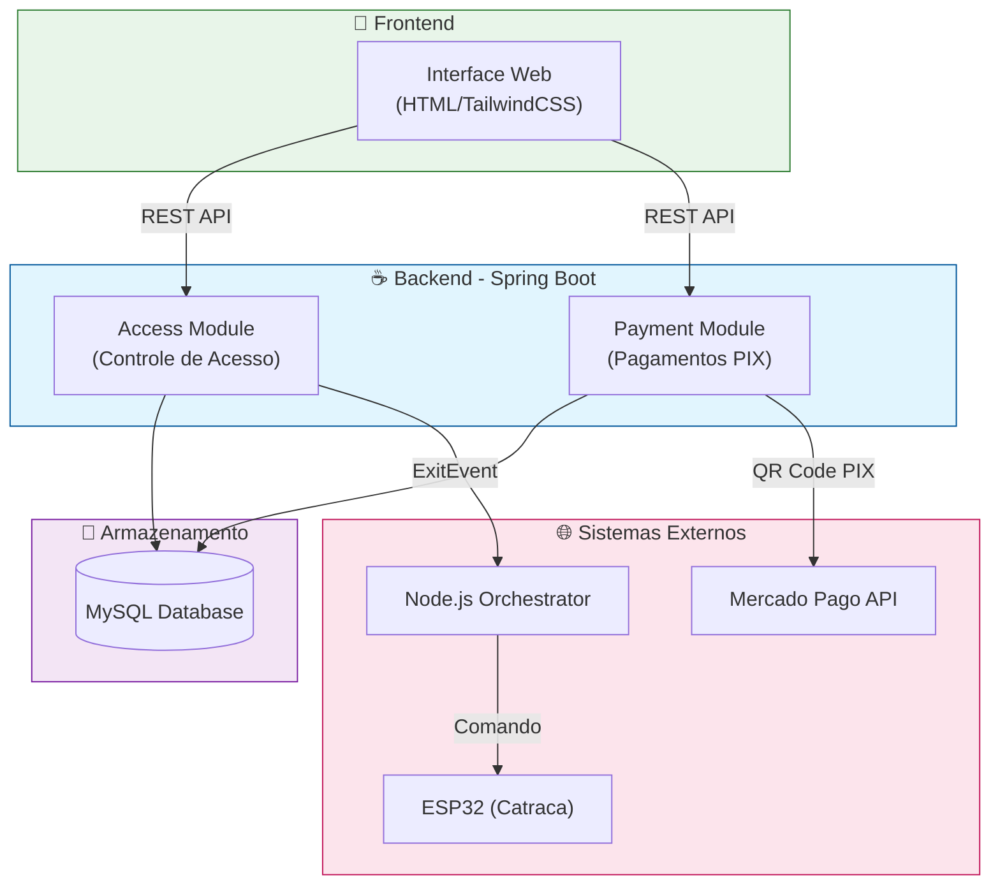

<div align="center">
  
# 🔐 Libera.ai

### Plataforma Inteligente de Gestão de Estacionamentos com Pagamento Automático

[](https://openjdk.java.net/)
[](https://spring.io/projects/spring-boot)
[](https://spring.io/)
[](https://www.mysql.com/)
[](https://www.mercadopago.com.br/)
[](https://www.docker.com/)
[](LICENSE)

</div>

---

## 📖 Sobre o Projeto

O **Libera.ai** é uma solução completa e moderna para **gestão de estacionamentos inteligentes**, integrando:

- 🚗 **Controle de Acesso Físico** via IoT (ESP32)
- 💳 **Processamento de Pagamentos** via PIX (Mercado Pago)
- 🎨 **Interface Web Responsiva** para terminais de saída
- 🏗️ **Arquitetura Modular** baseada em Clean Architecture e DDD

### 🌟 Principais Funcionalidades

- ✅ Registro automático de entrada/saída de veículos
- 💰 Cálculo automático de tarifa baseado em tempo de permanência
- 📱 Geração de QR Code PIX para pagamento instantâneo
- 🔄 Monitoramento de pagamento em tempo real (Server-Sent Events)
- 🚪 Integração com catracas/cancelas via ESP32
- 📊 Rastreamento completo com histórico em banco de dados

---

## 📂 Estrutura do Repositório

```
Libera.ai/
├── back/              # Backend - API REST (Java/Spring Boot)
│   ├── src/          # Código-fonte modular (Access + Payment)
│   ├── Dockerfile    # Container da aplicação
│   ├── compose.yml   # Orquestração Docker
│   └── README.md     # 📘 Documentação técnica completa
│
└── front/            # Frontend - Interface Web
    └── index.html    # Terminal de saída (HTML/TailwindCSS)
```

---

## 🚀 Quick Start

### Pré-requisitos

- Docker 20+ e Docker Compose
- Token de acesso do Mercado Pago ([obtenha aqui](https://www.mercadopago.com.br/developers))

### 1. Configuração

Crie o arquivo `.env` na pasta `back/`:

```env
# Banco de Dados
DB_ROOT_PASSWORD=sua_senha_segura
DB_NAME=libera_db
DB_USER=libera_user
DB_PASSWORD=sua_senha_segura

# Mercado Pago
MERCADOPAGO_ACCESS_TOKEN=seu_token_aqui

# Node.js (Orchestrator IoT)
NODE_HOST=172.17.0.1
NODE_PORT=3000
```

### 2. Executar

```bash
cd back/
docker compose up -d --build
```

### 3. Acessar

- **API**: http://localhost:8080
- **Terminal Web**: Abrir `front/index.html` no navegador
- **Health Check**: http://localhost:8080/actuator/health

---

## 📚 Documentação Completa

Para informações detalhadas sobre:

- 🏗️ **Arquitetura e Design Patterns**
- 💎 **Estrutura Modular (Bounded Contexts)**
- 🎨 **Camada de Apresentação (Presentation Layer)**
- 💳 **Sistema de Pagamentos (Mercado Pago PIX)**
- 🔌 **API Endpoints Completos**
- ⚡ **Detalhes de Engenharia (WebFlux, Virtual Threads, DDD)**

**👉 Consulte a [documentação técnica completa no backend](./back/README.md)**

---

## 🏗️ Arquitetura em Alto Nível



---

## 🛠️ Tech Stack Resumido

| Camada | Tecnologias |
|--------|-------------|
| **Backend** | Java 21, Spring Boot 3.5, Spring WebFlux, JPA/Hibernate |
| **Pagamentos** | Mercado Pago SDK Java, PIX |
| **Frontend** | HTML5, TailwindCSS, Vanilla JavaScript |
| **Banco de Dados** | MySQL 8.0 |
| **IoT** | ESP32, Node.js Orchestrator |
| **DevOps** | Docker, Docker Compose |

---

## 📊 Fluxo do Sistema

### Jornada Completa do Usuário

1. 🚗 **Entrada**: Veículo detectado → Código gerado → Catraca abre
2. 🕐 **Permanência**: Veículo estacionado (tempo calculado automaticamente)
3. 💳 **Pagamento**: Terminal web → QR Code PIX → Pagamento via app bancário
4. ✅ **Saída**: Pagamento confirmado → Catraca liberada → Saída registrada

---

## 🎯 Diferenciais Técnicos

| Característica | Implementação |
|----------------|---------------|
| **Modularidade** | Bounded Contexts (DDD) com módulos Access e Payment |
| **Escalabilidade** | Clean Architecture + Hexagonal Architecture |
| **Performance** | Java 21 Virtual Threads + WebFlux Reactive Streams |
| **Tempo Real** | Server-Sent Events (SSE) para status de pagamento |
| **Pagamentos** | Integração nativa com Mercado Pago PIX |
| **IoT** | Comunicação resiliente com ESP32 via Node.js |

---

## 📜 Licença

Este projeto está licenciado sob a **GNU General Public License v2.0** - veja o arquivo [LICENSE](LICENSE) para detalhes.

---

## 👥 Desenvolvido por

<div align="center">

**Centro WEG**

Desenvolvido com ☕ Java, 💚 Spring Boot e 🚀 paixão por tecnologia

</div>
