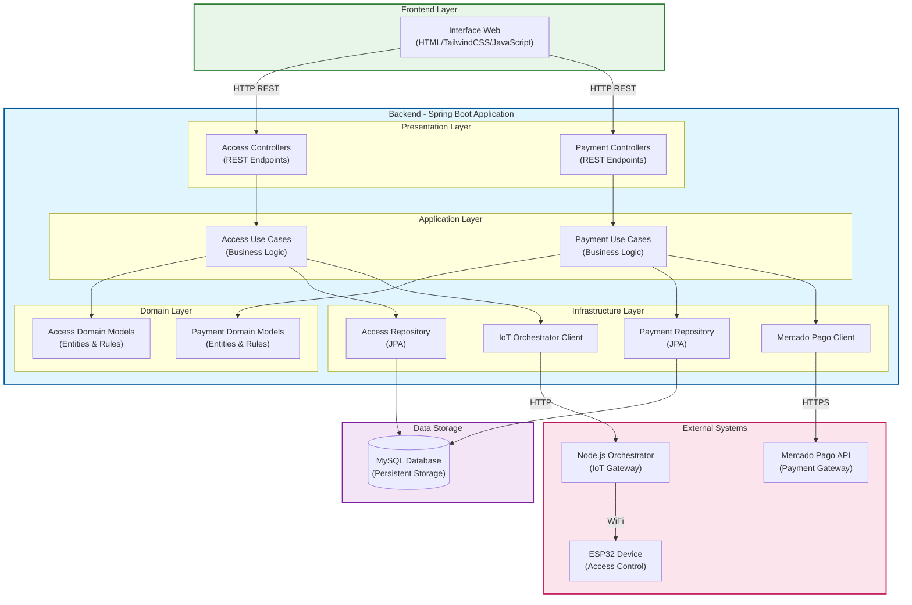
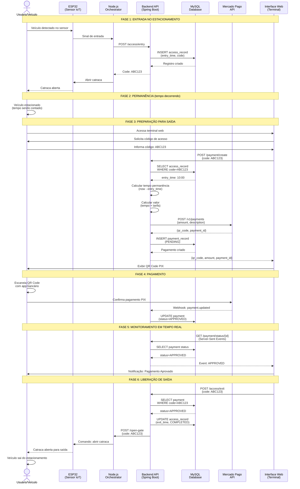

<div align="center">
  
# Libera.ai

### Plataforma Inteligente de Gestão de Estacionamentos com Pagamento Automático

[](https://openjdk.java.net/)
[](https://spring.io/projects/spring-boot)
[](https://spring.io/)
[](https://www.mysql.com/)
[](https://www.mercadopago.com.br/)
[](https://www.docker.com/)
[](LICENSE)

</div>

---

## Índice

- [Problema](#problema)
- [Solução](#solução)
- [Objetivos do Projeto](#objetivos-do-projeto)
- [Arquitetura do Sistema](#arquitetura-do-sistema)
- [Fluxo do Sistema](#fluxo-do-sistema)
- [Abordagem Técnica](#abordagem-técnica)
- [Estrutura do Repositório](#estrutura-do-repositório)
- [Configuração e Instalação](#configuração-e-instalação)
- [Tecnologias Utilizadas](#tecnologias-utilizadas)
- [Documentação Técnica Detalhada](#documentação-técnica-detalhada)
- [Licença](#licença)

---

## Problema

A gestão de estacionamentos comerciais enfrenta diversos desafios operacionais que impactam tanto a eficiência do negócio quanto a experiência do usuário:

### Desafios Operacionais Identificados

**1. Controle Manual e Ineficiente**
- Processos manuais de registro de entrada e saída são lentos e propensos a erros humanos
- Dificuldade em rastrear veículos em tempo real
- Falta de histórico confiável para auditoria e análise de dados

**2. Complexidade no Gerenciamento de Pagamentos**
- Cobrança manual de tarifas sujeita a erros de cálculo
- Necessidade de operadores para processar pagamentos
- Dificuldade em integrar métodos de pagamento modernos (PIX, cartões)
- Ausência de comprovantes digitais e rastreabilidade financeira

**3. Falta de Integração Tecnológica**
- Sistemas legados sem integração com dispositivos IoT
- Ausência de automação em cancelas e catracas
- Impossibilidade de monitoramento remoto
- Dados fragmentados em diferentes sistemas

**4. Experiência do Usuário Deficiente**
- Filas longas para pagamento na saída
- Processo de saída demorado
- Falta de transparência no cálculo de tarifas
- Métodos de pagamento limitados

**5. Escalabilidade Limitada**
- Sistemas monolíticos difíceis de manter e evoluir
- Impossibilidade de adicionar novas funcionalidades sem reescrever código existente
- Dificuldade em integrar novos pontos de acesso ou formas de pagamento

---

## Solução

O **Libera.ai** é uma plataforma completa de gestão de estacionamentos que automatiza todo o ciclo operacional, desde a entrada do veículo até a saída com pagamento validado. A solução integra controle de acesso físico via IoT, processamento de pagamentos via PIX, e interface web responsiva em uma arquitetura modular e escalável.

### Componentes Principais

**1. Módulo de Controle de Acesso**
- Registro automático de entrada de veículos com geração de código único
- Validação de saída com verificação de entrada prévia e pagamento
- Rastreamento completo de horários de entrada e saída
- Integração com catracas/cancelas via ESP32 e Node.js orchestrator
- Interface web para operação de terminais de saída

**2. Módulo de Pagamentos**
- Geração automática de pagamentos PIX via integração com Mercado Pago
- Cálculo de tarifa baseado em tempo de permanência (configurável)
- Geração de QR Code dinâmico para pagamento instantâneo
- Monitoramento de status de pagamento em tempo real via Server-Sent Events (SSE)
- Validação de pagamento antes da liberação de saída

**3. Camada de Apresentação**
- Interface web responsiva construída com HTML5 e TailwindCSS
- Design mobile-first para acesso em diferentes dispositivos
- Feedback visual em tempo real sobre status de operações
- Notificações de erro e sucesso
- Cálculo e exibição automática de tempo de permanência e valor a pagar

**4. Camada de Infraestrutura**
- Persistência de dados em MySQL com histórico completo de transações
- Containerização completa com Docker para facilitar deployment
- Orquestração de serviços via Docker Compose
- Configuração centralizada via variáveis de ambiente

---

## Objetivos do Projeto

### Objetivos de Negócio

1. **Automatizar Operações**: Eliminar processos manuais suscetíveis a erros, reduzindo custos operacionais e aumentando a confiabilidade
2. **Melhorar Experiência do Usuário**: Proporcionar processo de saída rápido e sem filas através de pagamento digital instantâneo
3. **Aumentar Receita**: Garantir cobrança precisa de todas as permanências através de rastreamento automatizado
4. **Facilitar Auditoria**: Manter histórico completo de todas as transações para análise e conformidade

### Objetivos Técnicos

1. **Modularidade**: Estruturar o sistema em módulos independentes (bounded contexts) que podem evoluir separadamente
2. **Escalabilidade**: Utilizar arquitetura que permita adicionar novos pontos de acesso, formas de pagamento, e funcionalidades sem refatoração massiva
3. **Manutenibilidade**: Aplicar padrões de Clean Architecture e Domain-Driven Design (DDD) para código limpo e testável
4. **Performance**: Utilizar programação reativa (WebFlux) e virtual threads do Java 21 para alta performance
5. **Resiliência**: Implementar comunicação confiável com sistemas externos (IoT, Mercado Pago) com tratamento de erros robusto
6. **Integração**: Criar APIs REST bem definidas para fácil integração com sistemas externos e futuros frontends

---

## Arquitetura do Sistema

### Visão Geral da Arquitetura

O Libera.ai foi projetado seguindo princípios de **Clean Architecture** e **Domain-Driven Design (DDD)**, organizando o código em **bounded contexts** independentes que representam diferentes domínios de negócio.



### Descrição das Camadas

**1. Presentation Layer (Camada de Apresentação)**
- **Responsabilidade**: Expor endpoints REST e mapear DTOs para modelos de domínio
- **Componentes**: Controllers, DTOs, Mappers
- **Padrão**: Isolamento completo da lógica de negócio, apenas coordenação de requisições
- **Tecnologia**: Spring WebFlux para programação reativa

**2. Application Layer (Camada de Aplicação)**
- **Responsabilidade**: Orquestrar casos de uso e lógica de negócio
- **Componentes**: Use Cases (serviços de aplicação)
- **Padrão**: Use Case por operação de negócio (RegisterEntry, ProcessPayment, etc.)
- **Benefício**: Lógica de negócio testável e reutilizável

**3. Domain Layer (Camada de Domínio)**
- **Responsabilidade**: Conter regras de negócio e entidades do domínio
- **Componentes**: Entidades de domínio, Value Objects, Ports (interfaces)
- **Padrão**: Independente de frameworks, contém apenas regras de negócio puras
- **Benefício**: Núcleo da aplicação protegido de mudanças em infraestrutura

**4. Infrastructure Layer (Camada de Infraestrutura)**
- **Responsabilidade**: Implementar detalhes técnicos e integrações externas
- **Componentes**: Repositórios JPA, Clientes HTTP, Adaptadores
- **Padrão**: Adapters para isolar dependências externas
- **Tecnologia**: Spring Data JPA, RestTemplate/WebClient

---

## Fluxo do Sistema

### Fluxo Completo: Entrada até Saída

O sistema opera em um ciclo completo que vai desde a detecção de entrada do veículo até a liberação de saída após pagamento confirmado.



### Detalhamento das Fases

**FASE 1: Entrada no Estacionamento**
1. Sensor ESP32 detecta presença do veículo
2. Sinal é enviado ao Node.js orchestrator
3. Orchestrator chama API REST (`POST /access/entry`)
4. Sistema gera código único e registra horário de entrada no banco
5. Código é retornado e catraca é acionada para abertura
6. Ticket com código é fornecido ao usuário

**FASE 2: Permanência**
- Veículo permanece estacionado
- Tempo de permanência é calculado automaticamente quando solicitado
- Nenhuma interação do sistema necessária nesta fase

**FASE 3: Preparação para Saída**
1. Usuário acessa terminal web de saída
2. Informa código do ticket
3. Sistema busca registro de entrada no banco de dados
4. Calcula tempo de permanência (horário atual - horário de entrada)
5. Aplica tarifa configurada (ex: R$ 10,00/hora)
6. Cria pagamento via API do Mercado Pago
7. Recebe QR Code PIX dinâmico
8. Exibe QR Code e valor para o usuário

**FASE 4: Pagamento**
1. Usuário escaneia QR Code com aplicativo bancário
2. Confirma pagamento PIX
3. Mercado Pago processa pagamento
4. Webhook notifica backend sobre mudança de status
5. Sistema atualiza status do pagamento no banco de dados

**FASE 5: Monitoramento em Tempo Real**
1. Interface web mantém conexão SSE (Server-Sent Events) com backend
2. Backend consulta status do pagamento periodicamente
3. Quando status muda para APPROVED, evento é enviado ao frontend
4. Interface atualiza visualmente o status e libera botão de saída

**FASE 6: Liberação de Saída**
1. Usuário clica em botão de saída após pagamento aprovado
2. Sistema valida se pagamento foi realmente aprovado
3. Registra horário de saída no banco de dados
4. Envia comando ao Node.js orchestrator
5. Orchestrator aciona ESP32 para abrir catraca
6. Veículo é liberado para saída
7. Registro é marcado como completo

---

## Abordagem Técnica

### Decisões Arquiteturais

**1. Clean Architecture + DDD**

**Motivação**: Sistemas de estacionamento precisam evoluir constantemente (novos métodos de pagamento, integração com novos dispositivos IoT, novos tipos de tarifação). Uma arquitetura monolítica ou acoplada dificulta essas evoluções.

**Implementação**:
- **Bounded Contexts**: Separação clara entre domínio de acesso físico (Access) e domínio de pagamentos (Payment)
- **Hexagonal Architecture**: Portas e adaptadores para isolar lógica de negócio de detalhes de infraestrutura
- **Camadas bem definidas**: Presentation → Application → Domain → Infrastructure
- **Dependency Inversion**: Camadas superiores não dependem de camadas inferiores; dependem de abstrações (interfaces/ports)

**Benefícios**:
- Fácil substituição de Mercado Pago por outro gateway de pagamento
- Possibilidade de adicionar novos tipos de dispositivos IoT sem alterar lógica de negócio
- Testes unitários da lógica de negócio sem dependências externas
- Cada módulo pode evoluir independentemente

**2. Programação Reativa com WebFlux**

**Motivação**: Operações críticas como monitoramento de pagamento requerem resposta em tempo real sem bloquear threads.

**Implementação**:
- Spring WebFlux para endpoints não-bloqueantes
- Server-Sent Events (SSE) para push de atualizações de status de pagamento
- Mono e Flux para operações assíncronas

**Benefícios**:
- Alta eficiência no uso de recursos (threads)
- Melhor experiência do usuário com atualizações em tempo real
- Capacidade de lidar com múltiplas conexões simultâneas

**3. Java 21 Virtual Threads**

**Motivação**: Combinar os benefícios de código síncrono (fácil de ler e manter) com performance de código assíncrono.

**Implementação**:
- Virtual threads para operações I/O intensivas (chamadas a banco de dados, APIs externas)
- Simplifica código comparado a callbacks ou programação reativa pura

**Benefícios**:
- Código mais simples e legível
- Performance superior em operações I/O bound
- Melhor aproveitamento de recursos do sistema

**4. Separação de Presentation Layer**

**Motivação**: Evitar acoplamento entre API REST e lógica de negócio, facilitando evolução independente e suporte a múltiplos clientes.

**Implementação**:
- Controllers exclusivamente responsáveis por coordenar requisições HTTP
- DTOs específicos para API, separados de entidades de domínio
- Mappers para conversão entre DTOs e modelos de domínio
- Validações de entrada na camada de apresentação

**Benefícios**:
- API pode evoluir sem afetar lógica de negócio
- Possibilidade de criar APIs alternativas (GraphQL, gRPC) usando mesma lógica
- Testes de API isolados de testes de negócio
- Segurança: entidades de domínio nunca expostas diretamente

**5. Integração via Adapters**

**Motivação**: Sistemas externos (Mercado Pago, ESP32) podem mudar ou serem substituídos.

**Implementação**:
- Interfaces (ports) definem contratos na camada de domínio
- Adaptadores implementam interfaces usando bibliotecas específicas
- Configuração via injeção de dependência do Spring

**Benefícios**:
- Fácil substituição de implementações
- Possibilidade de mocks para testes
- Isolamento de mudanças em APIs externas

### Padrões de Design Utilizados

**1. Repository Pattern**
- Abstração do acesso a dados
- Permite trocar implementação de persistência

**2. Use Case Pattern**
- Cada operação de negócio é uma classe separada
- Facilita testes e manutenção

**3. DTO Pattern**
- Separação entre modelos de API e modelos de domínio
- Controle sobre dados expostos

**4. Adapter Pattern**
- Isolamento de dependências externas
- Facilitação de substituição de implementações

**5. Event-Driven Pattern**
- Server-Sent Events para comunicação em tempo real
- Webhooks para receber notificações do Mercado Pago

---

## Estrutura do Repositório

```
Libera.ai/
├── back/                          # Backend - API REST (Java/Spring Boot)
│   ├── src/
│   │   ├── main/
│   │   │   └── java/br/centroweg/libera_ai/
│   │   │       ├── module/
│   │   │       │   ├── access/           # Módulo de Controle de Acesso
│   │   │       │   │   ├── presentation/    # Controllers, DTOs
│   │   │       │   │   ├── application/     # Use Cases
│   │   │       │   │   ├── domain/          # Entidades, Portas
│   │   │       │   │   └── infrastructure/  # Repositórios, Adaptadores
│   │   │       │   │
│   │   │       │   └── payment/          # Módulo de Pagamentos
│   │   │       │       ├── presentation/    # Controllers, DTOs
│   │   │       │       ├── application/     # Use Cases
│   │   │       │       ├── domain/          # Entidades, Portas
│   │   │       │       └── infrastructure/  # Repositórios, Mercado Pago
│   │   │       │
│   │   │       └── share/            # Código compartilhado
│   │   │           ├── config/          # Configurações Spring
│   │   │           └── exception/       # Exceções globais
│   │   │
│   │   └── resources/
│   │       └── application.yml      # Configuração da aplicação
│   │
│   ├── Dockerfile                   # Container da aplicação
│   ├── compose.yml                  # Orquestração Docker (app + MySQL)
│   ├── pom.xml                      # Dependências Maven
│   └── README.md                    # Documentação técnica detalhada
│
└── front/                         # Frontend - Interface Web
    └── index.html                 # Terminal de saída (HTML/TailwindCSS/JS)
```

### Organização Modular

O backend segue uma estrutura modular baseada em **Bounded Contexts** do DDD:

- **Access Module**: Gerencia entrada e saída de veículos, controle de acesso físico
- **Payment Module**: Gerencia criação e acompanhamento de pagamentos
- **Shared**: Contém código compartilhado entre módulos (configurações, exceções)

Cada módulo segue a estrutura de Clean Architecture:
- **Presentation**: Interface com o mundo externo (REST API)
- **Application**: Casos de uso e orquestração
- **Domain**: Lógica de negócio pura e entidades
- **Infrastructure**: Detalhes de implementação (banco, APIs externas)

---

## Configuração e Instalação

### Pré-requisitos

- **Docker** 20+ e **Docker Compose** 1.29+
- **Token de acesso do Mercado Pago** ([obter aqui](https://www.mercadopago.com.br/developers))
- **Node.js Orchestrator** (gateway entre backend e ESP32)

### Passo 1: Configurar Variáveis de Ambiente

Crie o arquivo `.env` na pasta `back/`:

```env
# Configurações do Banco de Dados MySQL
DB_ROOT_PASSWORD=sua_senha_root_segura
DB_NAME=libera_db
DB_USER=libera_user
DB_PASSWORD=sua_senha_usuario_segura

# Credenciais do Mercado Pago
MERCADOPAGO_ACCESS_TOKEN=seu_access_token_mercadopago

# Configurações do Node.js Orchestrator (IoT Gateway)
NODE_HOST=172.17.0.1
NODE_PORT=3000
```

**Notas importantes**:
- O `MERCADOPAGO_ACCESS_TOKEN` pode ser obtido no [painel de desenvolvedores do Mercado Pago](https://www.mercadopago.com.br/developers)
- Use tokens de **teste** durante desenvolvimento e **produção** apenas em ambiente real
- O `NODE_HOST` deve apontar para o endereço onde o orchestrator Node.js está rodando
- Ajuste as senhas do banco de dados para senhas fortes em ambiente de produção

### Passo 2: Iniciar os Serviços

```bash
cd back/
docker compose up -d --build
```

Este comando irá:
1. Construir a imagem Docker da aplicação Spring Boot
2. Iniciar container MySQL com as configurações especificadas
3. Iniciar container da aplicação
4. Criar automaticamente as tabelas no banco de dados (via JPA/Hibernate)

### Passo 3: Verificar a Instalação

**API Backend**:
```bash
curl http://localhost:8080/actuator/health
```

Resposta esperada:
```json
{
  "status": "UP"
}
```

**Banco de Dados**:
```bash
docker exec -it libera-mysql mysql -u libera_user -p libera_db
```

### Passo 4: Acessar a Aplicação

- **API Backend**: http://localhost:8080
- **Health Check**: http://localhost:8080/actuator/health
- **Terminal Web**: Abra o arquivo `front/index.html` em um navegador
  - Certifique-se de que o navegador pode acessar `http://localhost:8080`

### Comandos Úteis

**Ver logs da aplicação**:
```bash
docker compose logs -f app
```

**Ver logs do MySQL**:
```bash
docker compose logs -f mysql
```

**Parar os serviços**:
```bash
docker compose down
```

**Reiniciar os serviços**:
```bash
docker compose restart
```

**Limpar dados e recomeçar**:
```bash
docker compose down -v  # Remove volumes (dados do banco)
docker compose up -d --build
```

---

## Tecnologias Utilizadas

### Backend

| Categoria | Tecnologia | Versão | Propósito |
|-----------|-----------|--------|-----------|
| **Linguagem** | Java | 21 LTS | Linguagem principal com virtual threads |
| **Framework** | Spring Boot | 3.5 | Framework principal da aplicação |
| **Web Framework** | Spring WebFlux | 6.x | Programação reativa e SSE |
| **Persistência** | Spring Data JPA | 3.x | Abstração de acesso a dados |
| **ORM** | Hibernate | 6.x | Mapeamento objeto-relacional |
| **Banco de Dados** | MySQL | 8.0 | Armazenamento persistente |
| **Pagamentos** | Mercado Pago SDK | Última | Integração com gateway de pagamentos |
| **Containerização** | Docker | 20+ | Containerização da aplicação |
| **Orquestração** | Docker Compose | 1.29+ | Gerenciamento multi-container |

### Frontend

| Categoria | Tecnologia | Propósito |
|-----------|-----------|-----------|
| **Estrutura** | HTML5 | Marcação semântica |
| **Estilização** | TailwindCSS | Framework CSS utilitário |
| **Interatividade** | Vanilla JavaScript | Lógica do cliente e comunicação com API |
| **Tempo Real** | Server-Sent Events (SSE) | Atualizações de status em tempo real |

### IoT / Hardware

| Categoria | Tecnologia | Propósito |
|-----------|-----------|-----------|
| **Microcontrolador** | ESP32 | Controle de catracas/cancelas |
| **Gateway** | Node.js | Orchestrator entre backend e ESP32 |
| **Protocolo** | HTTP/WiFi | Comunicação entre componentes |

### DevOps e Infraestrutura

| Categoria | Tecnologia | Propósito |
|-----------|-----------|-----------|
| **Build Tool** | Maven | Gerenciamento de dependências e build |
| **Monitoramento** | Spring Actuator | Health checks e métricas |
| **Logging** | SLF4J + Logback | Sistema de logs |

---

## Documentação Técnica Detalhada

Este README apresenta uma visão geral do projeto. Para documentação técnica completa, incluindo:

- **Arquitetura Detalhada**: Diagramas de camadas, fluxos de dados, decisões arquiteturais
- **API Endpoints**: Documentação completa de todos os endpoints REST
- **Modelos de Dados**: Esquemas de banco de dados e relacionamentos
- **Casos de Uso**: Descrição detalhada de cada operação de negócio
- **Integrações Externas**: Detalhes sobre Mercado Pago, ESP32, webhooks
- **Configurações Avançadas**: Opções de configuração e tuning de performance
- **Guias de Desenvolvimento**: Como adicionar novos módulos ou funcionalidades

**Consulte**: [back/README.md](./back/README.md)

---

## Licença

Este projeto está licenciado sob a **GNU General Public License v2.0**.

A GPL v2.0 é uma licença de software livre que garante aos usuários finais as liberdades de usar, estudar, compartilhar e modificar o software. Para mais detalhes, consulte o arquivo [LICENSE](LICENSE).

---

## Autores

**Centro WEG**

Projeto desenvolvido com foco em arquitetura limpa, qualidade de código e boas práticas de engenharia de software.
