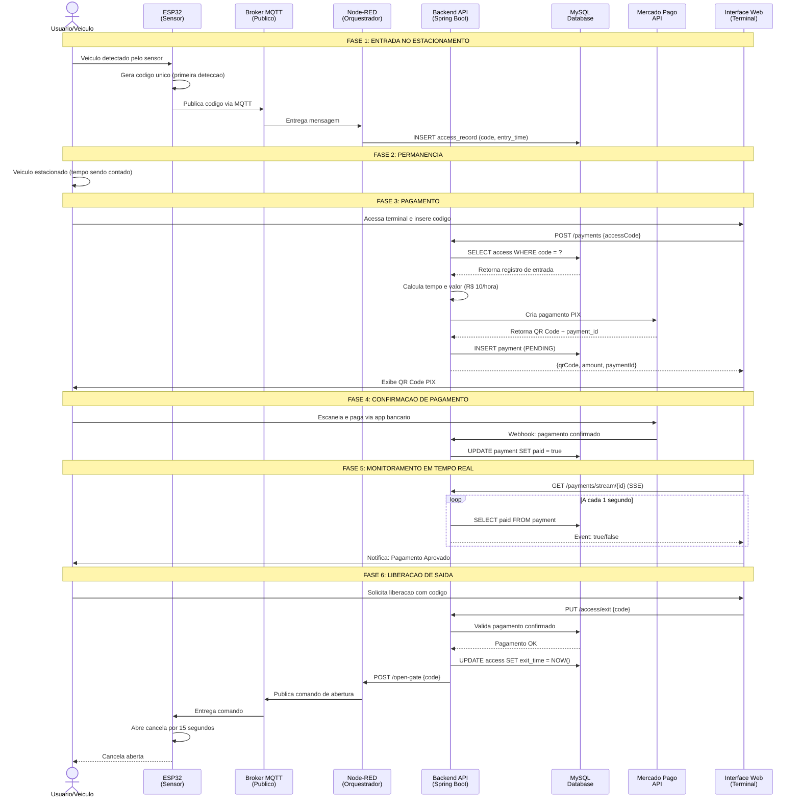
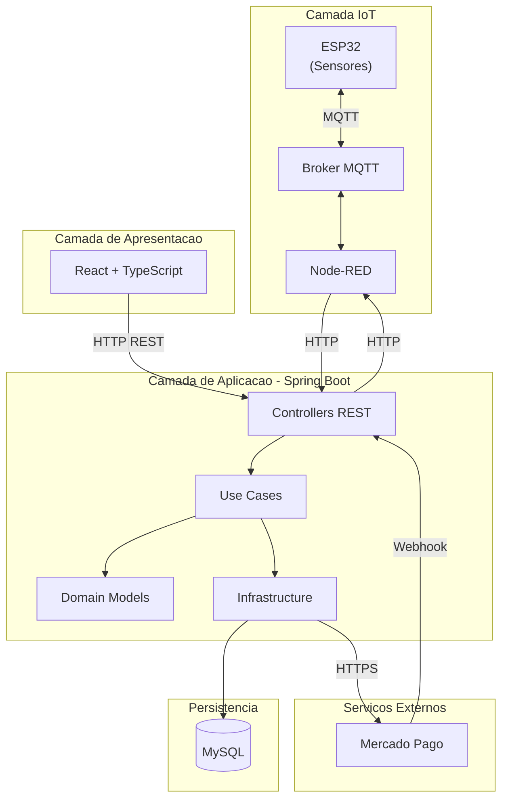

<div align="center">
  
# Libera.ai

### Sistema Inteligente de Gestão de Estacionamentos com IoT e Pagamento PIX

[](https://openjdk.java.net/)
[](https://spring.io/projects/spring-boot)
[](https://spring.io/)
[](https://www.mysql.com/)
[](https://www.mercadopago.com.br/)
[](https://www.docker.com/)
[](LICENSE)

</div>

---

## Indice

- [Problema](#problema)
- [Solucao](#solucao)
- [Fluxo do Sistema](#fluxo-do-sistema)
- [Tecnologias e Justificativas](#tecnologias-e-justificativas)
- [Arquitetura do Sistema](#arquitetura-do-sistema)
- [Estrutura do Repositorio](#estrutura-do-repositorio)
- [Configuracao e Instalacao](#configuracao-e-instalacao)
- [Documentacao Tecnica Detalhada](#documentacao-tecnica-detalhada)
- [Licenca](#licenca)

---

## Problema

Estacionamentos comerciais enfrentam diversos desafios operacionais que impactam diretamente a experiencia do usuario e a eficiencia do negocio:

**Processos Manuais e Lentos**
- Cobranca manual de tarifas propensa a erros de calculo
- Filas longas nos caixas de pagamento, especialmente em horarios de pico
- Necessidade de operadores humanos para cada transacao

**Controle de Acesso Ineficiente**
- Cancelas operadas manualmente ou com sistemas desconectados
- Impossibilidade de rastrear tempo real de permanencia
- Falta de integracao entre entrada, permanencia e saida

**Metodos de Pagamento Limitados**
- Dependencia de dinheiro ou cartao fisico
- Dificuldade em adotar pagamentos digitais modernos como PIX
- Processos de conciliacao financeira complexos

**Sistemas Legados**
- Solucoes antigas dificeis de escalar e manter
- Integracao complexa com novos dispositivos IoT
- Falta de visibilidade em tempo real das operacoes

---

## Solucao

O **Libera.ai** e uma plataforma completa que automatiza todo o ciclo operacional do estacionamento, desde a deteccao da entrada ate a liberacao da saida com pagamento validado.

O sistema utiliza sensores IoT (ESP32) para detectar veiculos automaticamente, comunicacao MQTT para transmissao de dados em tempo real, processamento de pagamentos via PIX com o Mercado Pago, e uma interface web responsiva para interacao do usuario.

### Componentes da Solucao

| Componente | Funcao | Tecnologia Principal |
|------------|--------|----------------------|
| **Deteccao de Entrada** | Sensores identificam veiculos e geram codigo unico | ESP32 + Sensor |
| **Comunicacao IoT** | Transmissao de eventos entre dispositivos | MQTT + Broker Publico |
| **Orquestracao** | Recebe eventos MQTT e interage com backend | Node-RED |
| **Backend API** | Logica de negocio e integracao de pagamentos | Spring Boot + WebFlux |
| **Pagamentos** | Geracao de QR Code PIX e confirmacao | Mercado Pago SDK |
| **Interface Web** | Terminal de pagamento e liberacao de saida | React + TypeScript |
| **Banco de Dados** | Persistencia de acessos e pagamentos | MySQL |

### Diferenciais

- **Pagamento PIX**: Metodo de pagamento instantaneo e sem taxas para o usuario
- **Tempo Real**: Atualizacoes de status via Server-Sent Events (SSE)
- **Automacao Completa**: Desde a deteccao ate a liberacao sem intervencao humana
- **Arquitetura Moderna**: Clean Architecture e DDD para escalabilidade e manutencao

---

## Fluxo do Sistema

O sistema opera em um ciclo completo que vai desde a deteccao de entrada do veiculo ate a liberacao de saida apos pagamento confirmado.

### Diagrama de Fluxo Completo



### Detalhamento das Fases

| Fase | Descricao | Componentes Envolvidos |
|------|-----------|------------------------|
| **1. Entrada** | Sensor ESP32 detecta veiculo e gera codigo unico. Codigo e publicado via MQTT e Node-RED insere no banco de dados. | ESP32, MQTT Broker, Node-RED, MySQL |
| **2. Permanencia** | Veiculo permanece no estacionamento. Sistema registra tempo de entrada para calculo posterior. | MySQL |
| **3. Pagamento** | Usuario insere codigo no terminal web. Sistema calcula valor baseado no tempo e gera QR Code PIX via Mercado Pago. | Frontend, Backend, Mercado Pago |
| **4. Confirmacao** | Usuario paga via PIX. Mercado Pago envia webhook ao backend confirmando pagamento. | Mercado Pago, Backend, MySQL |
| **5. Monitoramento** | Frontend mantem conexao SSE com backend, recebendo atualizacoes em tempo real sobre status do pagamento. | Frontend, Backend (WebFlux) |
| **6. Liberacao** | Usuario solicita saida. Backend valida pagamento e envia comando via HTTP para Node-RED, que publica via MQTT para ESP32 abrir a cancela. | Frontend, Backend, Node-RED, MQTT, ESP32 |

---

## Tecnologias e Justificativas

A escolha de cada tecnologia foi baseada em requisitos tecnicos e limitacoes do projeto academico.

### Backend

| Tecnologia | Justificativa |
|------------|---------------|
| **Java 21** | Linguagem robusta com Virtual Threads para alta concorrencia. Ecossistema maduro e ampla documentacao. |
| **Spring Boot 3.5** | Framework padrao de mercado para APIs REST. Facilita configuracao e integracao com banco de dados e servicos externos. |
| **Spring WebFlux** | Suporte nativo a Server-Sent Events (SSE) para atualizacoes em tempo real sem polling constante do cliente. |
| **MySQL 8.0** | Banco de dados relacional confiavel. Ideal para dados transacionais como acessos e pagamentos. |
| **Mercado Pago SDK** | SDK oficial para integracao PIX. Suporte a QR Code dinamico e webhooks para notificacao de pagamento. |

### Frontend

| Tecnologia | Justificativa |
|------------|---------------|
| **React 19** | Biblioteca moderna para interfaces reativas. Facilita gerenciamento de estado durante fluxo de pagamento. |
| **TypeScript** | Tipagem estatica previne erros em tempo de desenvolvimento. Melhora manutencao do codigo. |
| **Vite** | Build tool rapida com hot reload. Melhora produtividade durante desenvolvimento. |
| **TailwindCSS 4** | Estilizacao utilitaria permite desenvolvimento rapido de interface responsiva sem CSS customizado extenso. |

### IoT e Comunicacao

| Tecnologia | Justificativa |
|------------|---------------|
| **ESP32** | Microcontrolador com WiFi integrado. Baixo custo e amplamente usado em projetos IoT academicos. |
| **MQTT** | Protocolo leve ideal para IoT. Comunicacao assíncrona entre dispositivos com baixo consumo de recursos. |
| **Broker Publico** | Elimina necessidade de infraestrutura propria para o projeto academico. |
| **Node-RED** | Ferramenta visual para orquestracao de fluxos IoT. Conecta MQTT ao backend sem necessidade de codigo complexo. |

### Infraestrutura

| Tecnologia | Justificativa |
|------------|---------------|
| **Docker** | Containerizacao garante ambiente consistente entre desenvolvimento e producao. |
| **Docker Compose** | Orquestracao simples de multiplos containers (frontend, backend, banco). |

---

## Arquitetura do Sistema

O backend foi projetado seguindo principios de **Clean Architecture** e **Domain-Driven Design (DDD)**, organizando o codigo em bounded contexts independentes.

### Visao Geral



### Camadas do Backend

| Camada | Responsabilidade |
|--------|------------------|
| **Presentation** | Controllers REST, DTOs, validacao de entrada |
| **Application** | Use Cases que orquestram logica de negocio |
| **Domain** | Entidades e regras de negocio puras |
| **Infrastructure** | Repositorios JPA, integracao Mercado Pago, comunicacao Node-RED |

---

## Estrutura do Repositorio

```
Libera.ai/
├── back/                          # Backend - API REST (Java/Spring Boot)
│   ├── src/
│   │   └── main/java/br/centroweg/libera_ai/
│   │       ├── module/
│   │       │   ├── access/           # Modulo de Controle de Acesso
│   │       │   │   ├── presentation/    # Controllers, DTOs
│   │       │   │   ├── application/     # Use Cases
│   │       │   │   ├── domain/          # Entidades, Portas
│   │       │   │   └── infrastructure/  # Repositorios, Adaptadores
│   │       │   │
│   │       │   └── payment/          # Modulo de Pagamentos
│   │       │       ├── presentation/    # Controllers, DTOs
│   │       │       ├── application/     # Use Cases
│   │       │       ├── domain/          # Entidades, Portas
│   │       │       └── infrastructure/  # Repositorios, Mercado Pago
│   │       │
│   │       └── share/            # Codigo compartilhado
│   │
│   ├── Dockerfile
│   ├── compose.yml
│   ├── pom.xml
│   └── README.md                 # Documentacao tecnica do backend
│
├── front/                        # Frontend - Interface Web
│   ├── src/
│   │   ├── api/                  # Cliente API
│   │   ├── components/           # Componentes React
│   │   ├── hooks/                # Hooks customizados (SSE)
│   │   ├── pages/                # Paginas da aplicacao
│   │   └── types/                # Tipos TypeScript
│   │
│   ├── Dockerfile
│   ├── package.json
│   └── README.md                 # Documentacao tecnica do frontend
│
├── docker-compose.yml            # Orquestracao completa
└── README.md                     # Este arquivo
```

---

## Configuracao e Instalacao

### Pre-requisitos

- Docker 20+ e Docker Compose 1.29+
- Token de acesso do Mercado Pago ([obter aqui](https://www.mercadopago.com.br/developers))
- Node-RED configurado com broker MQTT (para integracao IoT completa)

### Configuracao de Variaveis de Ambiente

Crie o arquivo `.env` na raiz do projeto:

```env
# Banco de Dados MySQL
DB_ROOT_PASSWORD=sua_senha_root_segura
DB_NAME=libera_db
DB_USER=libera_user
DB_PASSWORD=sua_senha_usuario_segura

# Mercado Pago
MERCADOPAGO_ACCESS_TOKEN=seu_access_token_mercadopago

# Node-RED (orquestrador IoT)
NODE_HOST=172.17.0.1
NODE_PORT=1880
```

### Execucao com Docker Compose

```bash
# Iniciar todos os servicos
docker compose up -d --build

# Verificar status
docker compose ps

# Ver logs
docker compose logs -f
```

### Endpoints Disponiveis

| Servico | URL | Descricao |
|---------|-----|-----------|
| Frontend | http://localhost:3000 | Interface web do terminal |
| Backend API | http://localhost:8080 | API REST |
| Health Check | http://localhost:8080/actuator/health | Status da aplicacao |

### Variaveis de Ambiente

| Variavel | Descricao |
|----------|-----------|
| `DB_ROOT_PASSWORD` | Senha root do MySQL |
| `DB_NAME` | Nome do banco de dados |
| `DB_USER` | Usuario do banco |
| `DB_PASSWORD` | Senha do usuario |
| `MERCADOPAGO_ACCESS_TOKEN` | Token de acesso Mercado Pago |
| `NODE_HOST` | Host do Node-RED |
| `NODE_PORT` | Porta do Node-RED |

---

## Documentacao Tecnica Detalhada

Para informacoes tecnicas detalhadas sobre cada componente, consulte:

- **[Backend README](./back/README.md)**: Arquitetura, endpoints, integracao Mercado Pago, decisoes tecnicas
- **[Frontend README](./front/README.md)**: Componentes React, hooks SSE, integracao com API

---

## Licenca

Este projeto esta licenciado sob a **GNU General Public License v2.0**.

A GPL v2.0 garante aos usuarios as liberdades de usar, estudar, compartilhar e modificar o software. Para mais detalhes, consulte o arquivo [LICENSE](LICENSE).

---

## Autores

**Centro WEG**

Projeto academico desenvolvido com foco em arquitetura limpa, integracao IoT e boas praticas de engenharia de software.
